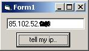



## this program says your online ip address with a too easy way\. see screenshot

### Description

k.domaindlx.com/nailgg/tr/ip.asp tells your ip address. this program downloads it with urldownloadtofile api.
 
### More Info
 

             |
---                |---
**Submitted On**   |2005-12-16 09:30:06
**By**             |[Nail Guzel](https://github.com/Planet-Source-Code/PSCIndex/blob/master/ByAuthor/nail-guzel.md)
**Level**          |Beginner
**User Rating**    |5.0 (10 globes from 2 users)
**Compatibility**  |VB 6\.0
**Category**       |[Internet/ HTML](https://github.com/Planet-Source-Code/PSCIndex/blob/master/ByCategory/internet-html__1-34.md)
**World**          |[Visual Basic](https://github.com/Planet-Source-Code/PSCIndex/blob/master/ByWorld/visual-basic.md)
**Archive File**   |[this\_progr19570512162005\.zip](https://github.com/Planet-Source-Code/nail-guzel-this-program-says-your-online-ip-address-with-a-too-easy-way-see-screenshot__1-63670/archive/master.zip)

